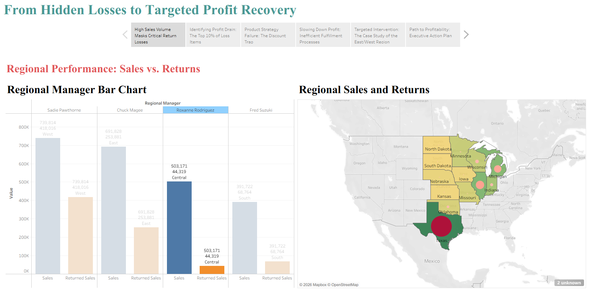

# 📊 360° Enterprise Performance Analytics  
### Superstore Dataset | Tableau Dashboard Project  

## 🔎 Project Overview  
This project presents a comprehensive business performance analysis using the Superstore dataset.  

The dashboard delivers a 360-degree view of enterprise performance by analyzing sales, profitability, customer segments, product categories, and regional trends.

🔗 **Live Tableau Dashboard:**  
https://public.tableau.com/app/profile/ch.sri.rama.seshu.p/viz/360EnterprisePerformanceAnalytics-SuperstoreDataSet/Story2

---

## 🎯 Business Objective  
To build interactive dashboards that help decision-makers:

- Monitor sales and profit trends  
- Identify high-performing regions and segments  
- Detect loss-making products  
- Optimize category-level performance  
- Support strategic business growth decisions  

---

## 📂 Dataset  
Superstore Dataset (Retail Business Data)

Includes:
- Orders
- Sales
- Profit
- Quantity
- Discount
- Customer Segments
- Regions & States
- Product Categories & Sub-Categories

---

## 📊 Dashboard Components  

### 1️⃣ Executive Overview  
- Total Sales  
- Total Profit  
- Profit Margin  
- Regional Performance  

### 2️⃣ Category & Sub-Category Analysis  
- Top-performing product categories  
- Loss-making segments  
- Discount impact on profitability  

### 3️⃣ Regional Performance  
- Sales by Region  
- State-level performance insights  
- Geographic trends  

### 4️⃣ Customer Segment Insights  
- Consumer vs Corporate vs Home Office  
- Segment-wise profitability comparison  

---

## 📈 Key Insights  

- High sales do not always translate to high profits due to discount impact  
- Certain sub-categories generate consistent losses  
- Regional disparities highlight growth opportunities  
- Discount strategy directly affects profit margins  

---

## 🛠 Tools Used  

- Tableau Desktop  
- Tableau Public  
- Calculated Fields  
- KPI Indicators  
- Interactive Filters  
- Storyboard Design  

---

## 📸 Dashboard Preview  

_Add screenshots inside the `screenshots/` folder and reference them here_

Example:
```markdown

```


